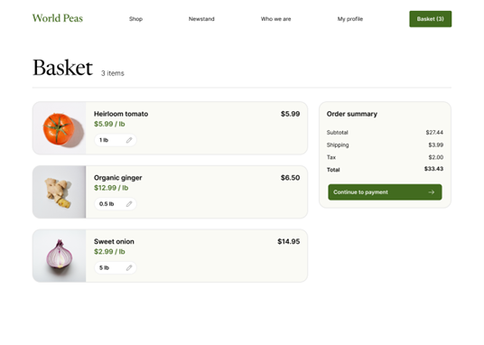
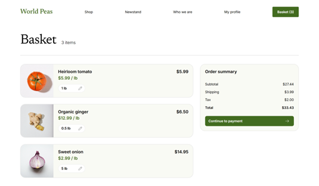
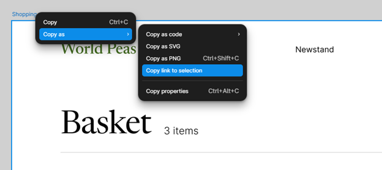
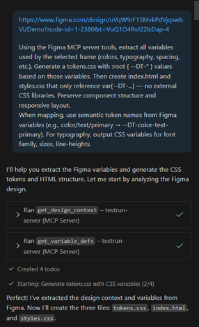

# Implementing Figma designs using GitHub Copilot and MCP Server

## Overview
- Connect VS Code to Figma MCP Server.
- Use GitHub Copilot Agent Mode to generate a web page from a Figma design.
- Apply Figma Variables as CSS Custom Properties (tokens) instead of external CSS frameworks.

## Prerequisites
- VS Code with GitHub Copilot with Agent mode enabled.
- A Figma account

## Steps
### 1. Import the Figma design to use
- On your account page, click the Import button on the top-right.
- Import the Figma demo file.

### 2. Setup Figma MCP Server
- Install Figma MCP Server in VS Code via Extensions (search @mcp Figma).
- In the VS Code search bar, type >MCP: Add Server.
- Select HTTP.
- Paste the MCP server URL: https://mcp.figma.com/mcp and press Enter.
- Type in the name for the server and press Enter.
- Select to add the server to the workspace.
- Complete the authentication process with your Figma account to allow VS Code to access it.
- The server is now installed and running.

### 3. Generate the site with GitHub Copilot
- In Figma, right-click the frame of the shopping cart page and select Copy as > Copy link to selection to retrieve the component’s URL.
- Prompt GHCP to build the site (see the example prompt in the notes section), using the variables and tokens from your design system by providing design details via the URL.
- Add adjustments as needed.

## Notes/Tips
- When creating a Figma file for use:
    - Use structured and relevant names for layers to provide richer context for the LLM regarding the document’s design and intended behaviour.
    - Use Auto Layout in frames for responsive behaviors and relationships.
    - Create a robust design system with tokens and variables that use semantic naming.

- Using the MCP Server requires:
    - A full or dev seat (free tiers get very limited access)
    - A Figma Design file to work from.
    - Edit or view permissions to the file.

- If the server stops running (e.g., from closing VS Code), you can start it again like so:

    - Type in the VS Code search bar >MCP: List Servers
    - Select the MCP server
    - Select Start

### Example Prompt
> \<Link to page frame>
> 
> Using the Figma MCP server tools, extract all variables used by the selected frame (colors, typography, spacing, etc.). Generate a tokens.css with :root { --DT-* } values based on those variables. Then create index.html and styles.css that only reference var(--DT-...) — no external CSS libraries. Preserve component structure and responsive layout.
> 
> When mapping, use semantic token names from Figma variables (e.g., color/text/primary → --DT-color-text-primary). For typography, output CSS variables for font family, sizes, line-heights.

### Images
_Figma Design_

_HTML Site_

_Getting Frame URL_

_Prompting GHCP_

## References
1.	[Designing with MCP Server: Bridging Design Systems and AI for Developer-Friendly Prototypes | by Iasonas Georgiadis | Bootcamp | Medium](https://medium.com/design-bootcamp/designing-with-mcp-server-bridging-design-systems-and-ai-for-developer-friendly-prototypes-4f08b0a0881d)
2.	[Guide to variables in Figma – Figma Learn - Help Center](https://help.figma.com/hc/en-us/articles/15339657135383-Guide-to-variables-in-Figma)
3.	[Guide to the Figma MCP server – Figma Learn - Help Center](https://help.figma.com/hc/en-us/articles/32132100833559-Guide-to-the-Figma-MCP-server)
4.	[Figma MCP collection – Figma Learn - Help Center](https://help.figma.com/hc/en-us/sections/35280374295831-Figma-MCP-collection)
5.	[Figma MCP collection: How to set up the Figma remote MCP server – Figma Learn - Help Center](https://help.figma.com/hc/en-us/articles/35281350665623-Figma-MCP-collection-How-to-set-up-the-Figma-remote-MCP-server)
